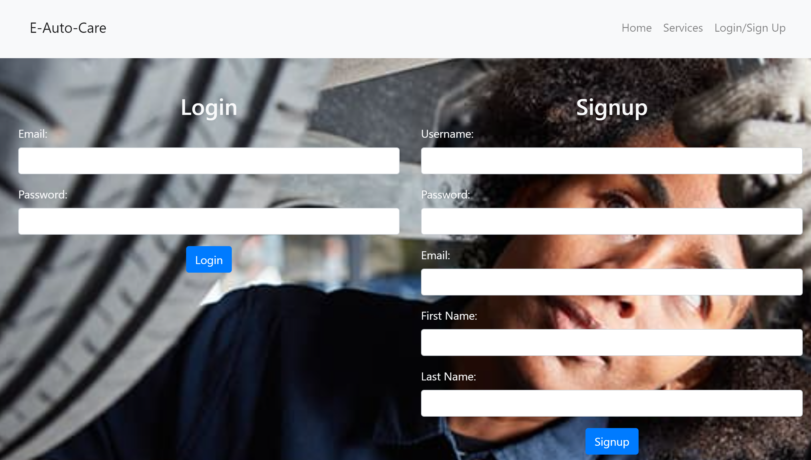
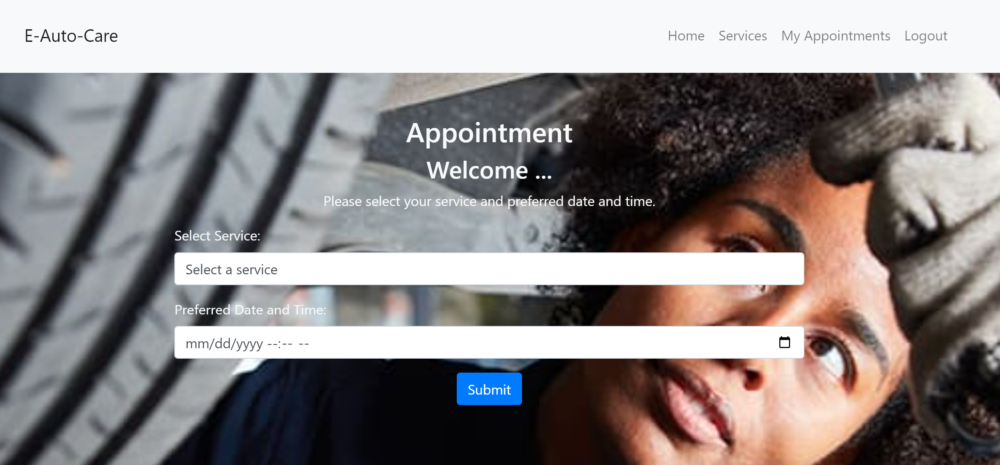

# E-Auto-Care

Visit [E-Auto-Care](https://e-auto-care-6acb9e4162bf.herokuapp.com/)

## Table of Contents
- [Description](#description-)
- [App Preview](#app-preview-)
- [Features](#features-)
- [Code Snippets](#code-snippets-)
- [Skills Improved](#skills-improved-️)
- [Future Improvements](#future-improvements-️)
- [Technologies](#technologies-️)
- [License](#license-)
- [Authors](#authors-️)

## Description 📖
E-Auto-Care is a backend application for managing auto care services. Users can create appointments, view available services, and manage their personal appointments through a user-friendly interface. The application ensures smooth handling of data with MySQL and provides secure authentication for user sessions.

## App Preview 👀




## Features ✨
1. **User Authentication** - Secure user login and signup functionality.
2. **Appointment Management** - Users can create, view, and manage their appointments.
3. **Service Selection** - Users can select services from a predefined list when creating appointments.
4. **Responsive Design** - Ensures a seamless experience on different devices.

## Code Snippets 💻

### Creating an Appointment
The following code snippet shows how appointments are created in the application:

```javascript
document.getElementById('appointmentForm').addEventListener('submit', async function(event) {
    event.preventDefault();

    const serviceId = document.getElementById('serviceDropdown').value;
    const appointmentDate = document.getElementById('appointmentDate').value;

    if (!serviceId || !appointmentDate) {
        alert('Please select a service and date/time for the appointment.');
        return;
    }

    const response = await fetch('/appointments/create', {
        method: 'POST',
        body: JSON.stringify({
            service_ID: serviceId,
            appointmentDate: appointmentDate
        }),
        headers: {
            'Content-Type': 'application/json'
        }
    });

    if (response.ok) {
        alert('Appointment successfully created! You can view it under the My Appointments tab.');
        window.location.replace('/appointments/all');
    } else {
        const errorMessage = await response.text();
        alert('Failed to create appointment: ' + errorMessage);
    }
});
```

### Backend Route from creating appointments
This shows how the backend handles appointment creation

```javascript
const express = require('express');
const router = express.Router();
const { Appointment, User, Service } = require('../models');
const withAuth = require('../utils/auth');

router.post('/create', withAuth, async (req, res) => {
    try {
        const { service_ID, appointmentDate } = req.body;

        const user = await User.findByPk(req.session.user_id);
        if (!user) {
            return res.status(404).json({ message: 'User not found' });
        }

        const appointment = await Appointment.create({
            user_id: req.session.user_id,
            date: appointmentDate.split('T')[0],
            time: appointmentDate.split('T')[1],
            service_ID: service_ID
        });

        res.status(201).json(appointment);
    } catch (err) {
        console.error('Error creating appointment:', err);
        res.status(500).json({ message: 'Internal server error' });
    }
});

module.exports = router;
```

## Skills Improved 🛠️
* Backend Development
* Authentication and Authorization
* RESTful API Design
* Data Management with MySQL
* Express.js
* Sequelize ORM
* Handlebars.js Templating
* Responsive Design

## Future Improvements 🔜
* Enhanced UI/UX for better user experience
* Integration with third-party services for more features
* Admin dashboard for managing services
* Real-time notifications for appointments
* Mobile application version

## Technologies 🔧
* [Node.js](https://nodejs.org/en)
* [Express.js](https://expressjs.com/)
* [Sequelize](https://sequelize.org/)
* [MySQL](https://www.mysql.com/)
* [Handlebars.js](https://handlebarsjs.com/)
* [Bootstrap](https://getbootstrap.com/)

## License 📄
This project is licensed under the MIT License - see the LICENSE for details.

## Authors 👤
### [Ralph Molu]
* [Github](https://github.com/ralphmolu)
* [LinkedIn](https://www.linkedin.com/in/ralph-molu/)

### [David Freeman]
* [Github](https://github.com/dfreeman3102)
* [LinkedIn](https://www.linkedin.com/in/david-freeman-536486294/)

### [Ian Hara]
* [Github](https://github.com/ianhara)
* [LinkedIn](https://www.linkedin.com/in/ian-h-62737230a/)

### [Armoni Prince]
* [Github](https://github.com/BiggieLittles)


